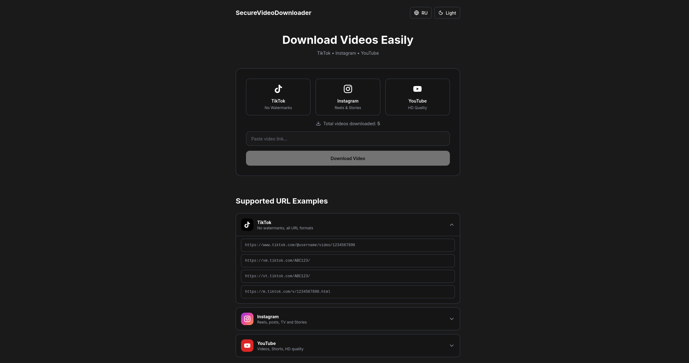
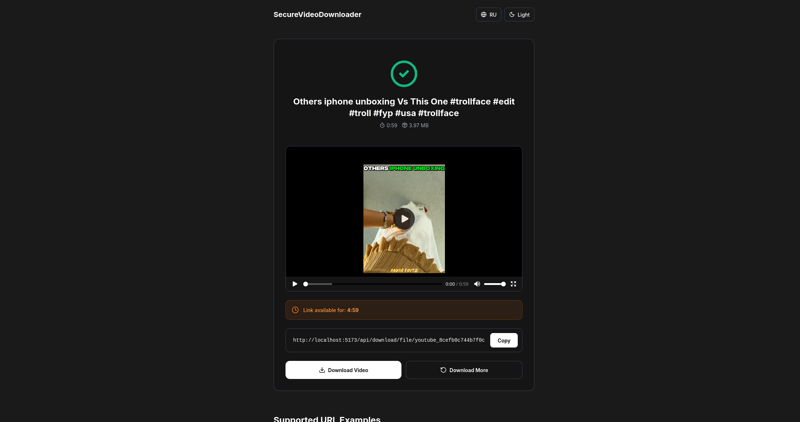
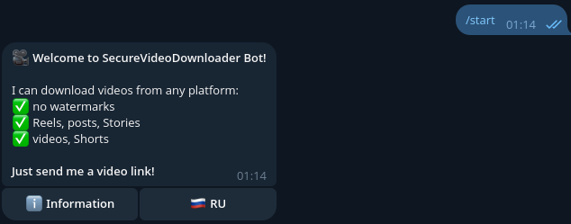

# 🎥 SecureVideoDownloader

[English](#english) | [Русский](#russian)

---

<a name="english"></a>

## 📖 English

### 🌟 Overview

**SecureVideoDownloader** is a modern, full-stack application for downloading videos from popular platforms like TikTok, Instagram, and YouTube. Built with security, speed, and user experience in mind.

### ✨ Features

- 🎵 **TikTok** - Download videos without watermarks
- 📸 **Instagram** - Support for Reels, Posts, Stories, and IGTV
- ▶️ **YouTube** - Download videos and Shorts in HD quality
- 🌐 **Multi-language** - English and Russian interface
- 🌙 **Dark/Light Mode** - Adaptive theme with system preference detection
- 🤖 **Telegram Bot** - Download videos directly in Telegram
- 📊 **Statistics** - Track total downloads and platform usage
- 🔒 **Secure** - No data collection, privacy-focused
- ⚡ **Fast** - Optimized performance with Redis caching
- 🎨 **Modern UI** - Beautiful, responsive design with Tailwind CSS
- 📱 **Mobile-friendly** - Works perfectly on all devices
- 🔗 **REST API** - Integrate video downloading into your apps

### 📸 Screenshots

- **Main Page**
  
  

- **Download Result**
  
  

- **Telegram Bot**
  
  

### 🏗️ Architecture

```
SecureVideoDownloader/
├── frontend/          # Vue.js 3 + Vite + Tailwind CSS
│   ├── src/
│   │   ├── components/    # Reusable Vue components
│   │   ├── composables/   # Vue composition functions
│   │   ├── utils/         # Helper functions & translations
│   │   └── App.vue        # Main application component
├── backend/           # Node.js + Express
│   ├── src/
│   │   ├── database/      # SQLite database operations
│   │   ├── downloaders/   # Platform-specific downloaders
│   │   ├── routes/        # API endpoints
│   │   └── utils/         # Helper utilities
├── telegram-bot/      # Telegram bot with Telegraf
│   ├── src/
│   │   ├── handlers/      # Message & command handlers
│   │   └── utils/         # Bot utilities & localization
└── screenshots/       # Application screenshots
```

### 🚀 Quick Start

#### Prerequisites

- Node.js 18+ 
- npm or yarn
- SQLite3

#### Installation

1. **Clone the repository**
   ```bash
   git clone https://github.com/yourusername/SecureVideoDownloader.git
   cd SecureVideoDownloader
   ```

2. **Install dependencies**
   ```bash
   # Install root dependencies
   npm install

   # Install frontend dependencies
   cd frontend && npm install && cd ..

   # Install backend dependencies
   cd backend && npm install && cd ..

   # Install telegram-bot dependencies
   cd telegram-bot && npm install && cd ..
   ```

3. **Configure environment variables**
   
   **Backend** (`backend/.env`):
   ```env
   PORT=3000
   NODE_ENV=development
   ```

   **Telegram Bot** (`telegram-bot/.env`):
   ```env
   BOT_TOKEN=your_telegram_bot_token_here
   BACKEND_URL=http://localhost:3000
   ```

4. **Start the application**

   **Option 1: All services at once (recommended)**
   ```bash
   npm run dev
   ```

   **Option 2: Start services individually**
   ```bash
   # Terminal 1 - Backend
   cd backend && npm run dev

   # Terminal 2 - Frontend
   cd frontend && npm run dev

   # Terminal 3 - Telegram Bot (optional)
   cd telegram-bot && npm run dev
   ```

5. **Access the application**
   - Frontend: http://localhost:5173
   - Backend API: http://localhost:3000
   - API Documentation: See [API.md](API.md)

### 🔧 Development

#### Frontend
- **Framework:** Vue.js 3 (Composition API)
- **Build Tool:** Vite
- **Styling:** Tailwind CSS
- **Icons:** Lucide Icons
- **HTTP Client:** Axios

#### Backend
- **Runtime:** Node.js
- **Framework:** Express
- **Database:** SQLite with better-sqlite3
- **Video Downloader:** yt-dlp
- **Rate Limiting:** express-rate-limit

#### Telegram Bot
- **Framework:** Telegraf
- **Language:** JavaScript (ESM)
- **Features:** Multi-language support, inline keyboards

### 📚 API Documentation

**Quick Example:**

```javascript
// Download video
const response = await fetch('http://localhost:3000/api/download', {
  method: 'POST',
  headers: { 'Content-Type': 'application/json' },
  body: JSON.stringify({
    url: 'https://www.tiktok.com/@user/video/123456'
  })
});

const data = await response.json();
console.log(data.downloadUrl);
```

### 📝 License

This project is licensed under the MIT License - see the LICENSE file for details.

---

<a name="russian"></a>

## 📖 Русский

### 🌟 Обзор

**SecureVideoDownloader** — это современное full-stack приложение для загрузки видео с популярных платформ, таких как TikTok, Instagram и YouTube. Разработано с акцентом на безопасность, скорость и удобство использования.

### ✨ Функции

- 🎵 **TikTok** - Загрузка видео без водяных знаков
- 📸 **Instagram** - Поддержка Reels, постов, Stories и IGTV
- ▶️ **YouTube** - Загрузка видео и Shorts в HD качестве
- 🌐 **Мультиязычность** - Интерфейс на английском и русском
- 🌙 **Тёмная/Светлая тема** - Адаптивная тема с определением системных настроек
- 🤖 **Telegram бот** - Загрузка видео прямо в Telegram
- 📊 **Статистика** - Отслеживание загрузок и использования платформ
- 🔒 **Безопасность** - Без сбора данных, фокус на приватность
- ⚡ **Быстро** - Оптимизированная производительность с Redis кэшированием
- 🎨 **Современный UI** - Красивый, адаптивный дизайн на Tailwind CSS
- 📱 **Мобильная версия** - Отлично работает на всех устройствах
- 🔗 **REST API** - Интегрируйте загрузку видео в свои приложения

### 📸 Скриншоты

- **Главная страница**
  
  

- **Результат загрузки**
  
  

- **Telegram бот**
  
  

### 🏗️ Архитектура

```
SecureVideoDownloader/
├── frontend/          # Vue.js 3 + Vite + Tailwind CSS
│   ├── src/
│   │   ├── components/    # Переиспользуемые Vue компоненты
│   │   ├── composables/   # Композиционные функции Vue
│   │   ├── utils/         # Вспомогательные функции и переводы
│   │   └── App.vue        # Главный компонент приложения
├── backend/           # Node.js + Express
│   ├── src/
│   │   ├── database/      # Операции с SQLite базой данных
│   │   ├── downloaders/   # Загрузчики для разных платформ
│   │   ├── routes/        # API endpoints
│   │   └── utils/         # Вспомогательные утилиты
├── telegram-bot/      # Telegram бот на Telegraf
│   ├── src/
│   │   ├── handlers/      # Обработчики сообщений и команд
│   │   └── utils/         # Утилиты бота и локализация
└── screenshots/       # Скриншоты приложения
```

### 🚀 Быстрый старт

#### Требования

- Node.js 18+ 
- npm или yarn
- SQLite3

#### Установка

1. **Клонируйте репозиторий**
   ```bash
   git clone https://github.com/yourusername/SecureVideoDownloader.git
   cd SecureVideoDownloader
   ```

2. **Установите зависимости**
   ```bash
   # Установка корневых зависимостей
   npm install

   # Установка зависимостей frontend
   cd frontend && npm install && cd ..

   # Установка зависимостей backend
   cd backend && npm install && cd ..

   # Установка зависимостей telegram-bot
   cd telegram-bot && npm install && cd ..
   ```

3. **Настройте переменные окружения**
   
   **Backend** (`backend/.env`):
   ```env
   PORT=3000
   NODE_ENV=development
   ```

   **Telegram Bot** (`telegram-bot/.env`):
   ```env
   BOT_TOKEN=ваш_токен_telegram_бота
   BACKEND_URL=http://localhost:3000
   ```

4. **Запустите приложение**

   **Вариант 1: Все сервисы сразу (рекомендуется)**
   ```bash
   npm run dev
   ```

   **Вариант 2: Запуск сервисов по отдельности**
   ```bash
   # Терминал 1 - Backend
   cd backend && npm run dev

   # Терминал 2 - Frontend
   cd frontend && npm run dev

   # Терминал 3 - Telegram Bot (опционально)
   cd telegram-bot && npm run dev
   ```

5. **Откройте приложение**
   - Frontend: http://localhost:5173
   - Backend API: http://localhost:3000
   - Документация API: См. [API.md](API.md)

### 🔧 Разработка

#### Frontend
- **Фреймворк:** Vue.js 3 (Composition API)
- **Сборщик:** Vite
- **Стили:** Tailwind CSS
- **Иконки:** Lucide Icons
- **HTTP клиент:** Axios

#### Backend
- **Runtime:** Node.js
- **Фреймворк:** Express
- **База данных:** SQLite с better-sqlite3
- **Загрузчик видео:** yt-dlp
- **Rate Limiting:** express-rate-limit

#### Telegram Bot
- **Фреймворк:** Telegraf
- **Язык:** JavaScript (ESM)
- **Функции:** Мультиязычная поддержка, inline клавиатуры

### 📚 Документация API

**Быстрый пример:**

```javascript
// Загрузка видео
const response = await fetch('http://localhost:3000/api/download', {
  method: 'POST',
  headers: { 'Content-Type': 'application/json' },
  body: JSON.stringify({
    url: 'https://www.tiktok.com/@user/video/123456'
  })
});

const data = await response.json();
console.log(data.downloadUrl);
```

### 📝 Лицензия

Этот проект лицензирован по лицензии MIT - см. файл LICENSE для деталей.

---

**Made with ❤️**